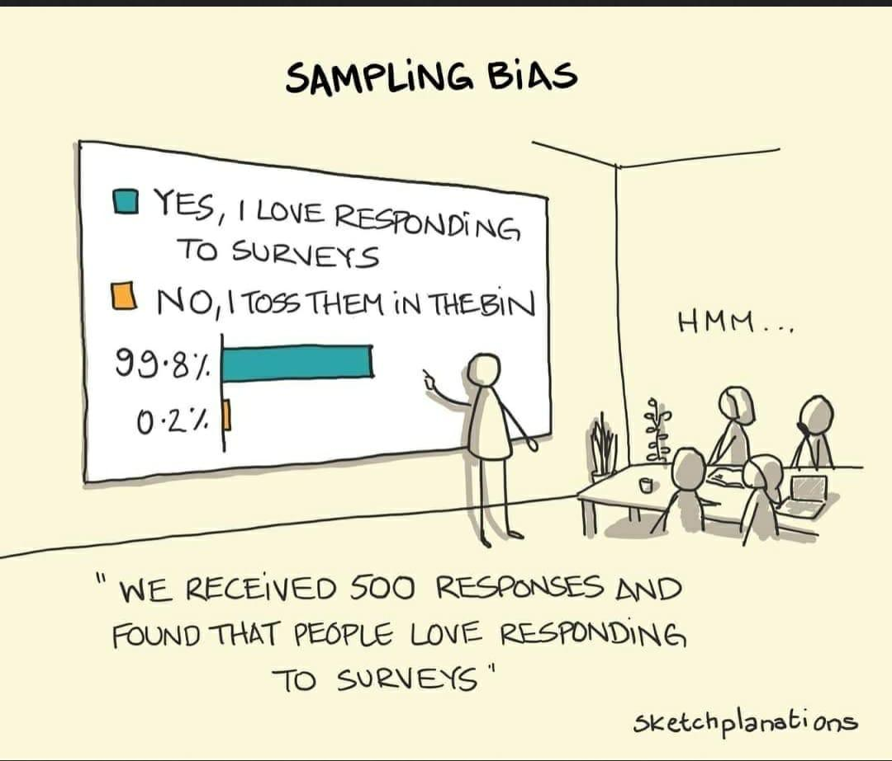
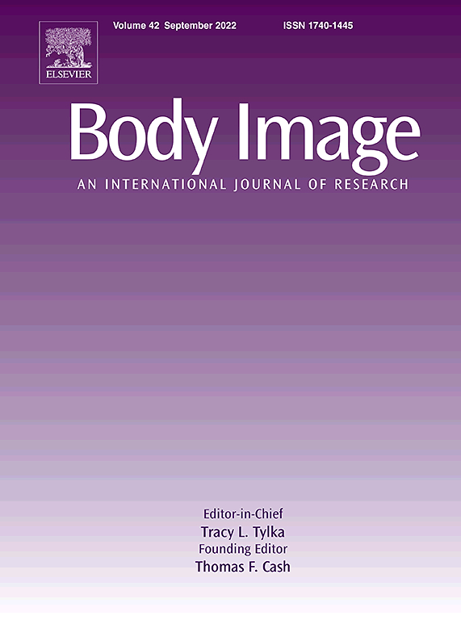
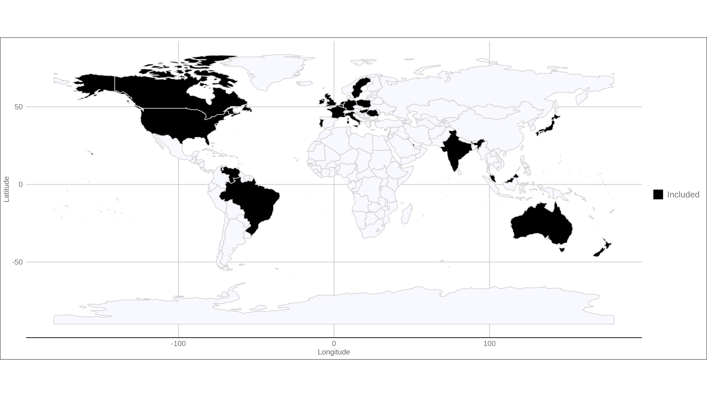
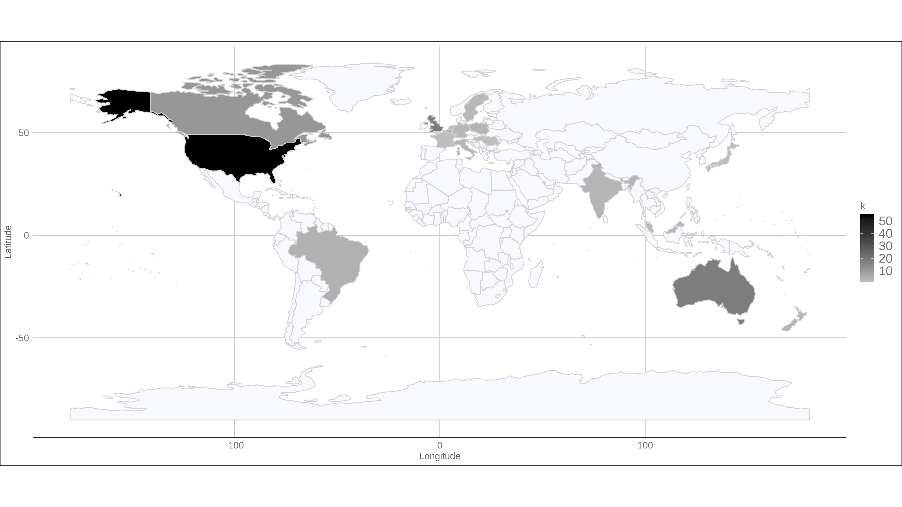
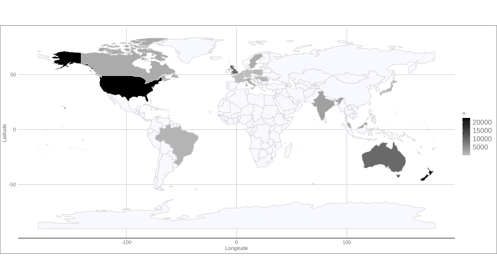
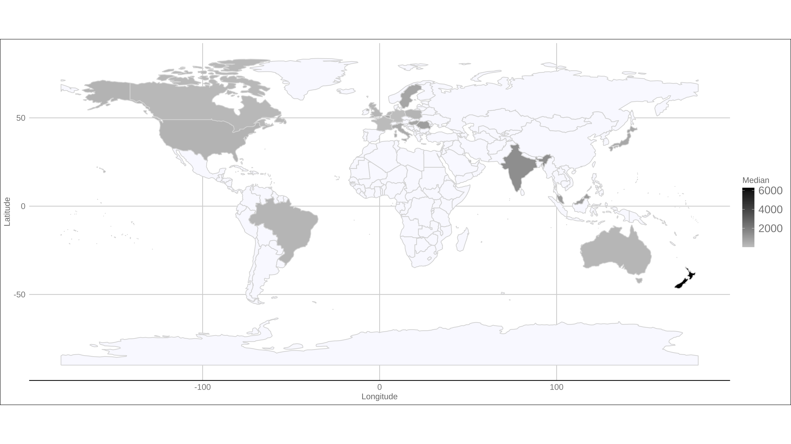
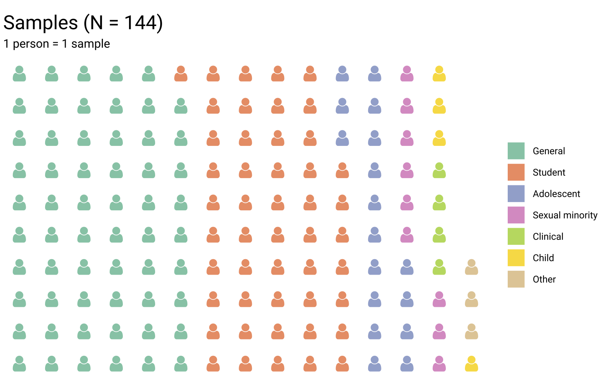

```{r setup, include=FALSE}
options(htmltools.dir.version = FALSE)
knitr::opts_chunk$set(echo = TRUE)
```

```{r echo=F, message=F, warning = F}
require(xaringanExtra) 
require(stargazer)
require(tidyverse)
require(knitr)
require(kableExtra)
require(DT)
```

```{r xaringan-logo, echo=FALSE}
xaringanExtra::use_logo("NU2.png")
```

```{r xaringan-tile-view, echo=FALSE}
xaringanExtra::use_tile_view()
# Below generates a new class of simulation table, as otherwise it will not fit.
```

```{css, echo = F}
table {
  font-size: 16px;     
}
```

```{css, echo = F}
.simulation_small table {
  font-size: 5.9px;     
}
```

```{css, echo = F}
.simulation table {
  font-size: 10px;     
}
```

## Samples in psychology


* Describing the samples we use. 

--

--> Recurrent criticism that psychology relies on student samples (e.g., [Thalmayer et al. 2020](https://doi.org/10.1037/amp0000622))

--

--> [W.E.I.R.D.](https://www2.psych.ubc.ca/~henrich/pdfs/WeirdPeople.pdf) : Western Educated Industrialised Rich and Democratic

--

Previous project on samples used in [Evolution and Human Behaviour and Evolutionary Psychology](https://link.springer.com/article/10.1007/s40806-019-00192-2).

```{r, out.width = "320px", echo=FALSE, fig.align='center'}
 
```


???
70% Online or student samples / >80% from 'Western' countries (Europe, USA/CAN/AUS)

---
## Sampling

A closer look at the samples being used in _Body Image_

--

Descriptive project

--

* Are samples different from general population in terms of BMI?

```{r, out.width = "400px", echo=FALSE, fig.align='center'}
knitr::include_graphics("https://media.giphy.com/media/3orieOSgDeu3pHrFIY/giphy.gif") 
```

???
Why focus on age and BMI. Interesting variables: Aging population / population becoming more obese.
Separate gen. pop. and students.

---
## Methodology.

* All papers from 2021 from _Body Image_ (_n_ = 137).

* 149 samples (5 meta-analyses or content analyses not analysed further).

```{r, out.width = "300px", echo=FALSE, fig.align='center'}
 # See Elsevier web page
```

---
## Methodology: Simulations

* **BMI**. Overall population estimate by gender from [NCD Risk Factor Collaboration (NCD-RisC)](https://linkinghub.elsevier.com/retrieve/pii/S0140673617321293) from 2016. Further checks with matched age groups.

--

* 100k simulations. One simulation: Draw a random sample (_n_) of the same size as the original study's sample size. $n \sim \mathcal{N}(\mu,\,\sigma^{2})$ using the Means and SD provided. We then perform a one sample _t_-test against the reference value. 

--

* median _p_ value of those 100k simulations.

--

```{r, out.width = "300px", echo=FALSE, fig.align='center'}
knitr::include_graphics("https://media.giphy.com/media/lqvkE2eYHvPillZKNU/giphy.gif")
```

???
Also completed age sims.

---
## Map: Inclusion.

```{r, out.width = "800px", echo=FALSE, fig.align='center'}

```

???
Some coverage of Latin America, no coverage of Africa, China, Russia
Majority of quantitative samples are from the United States (n = 55), followed by the United Kingdom (n = 18), Australia (n = 18) and Canada (n = 11).

---
## Map: k samples.

```{r, out.width = "800px", echo=FALSE, fig.align='center'}

```

???
Some coverage of Latin America, no coverage of Africa, China, Russia
Majority of quantitative samples are from the United States (n = 55), followed by the United Kingdom (n = 18), Australia (n = 18) and Canada (n = 11). Map does not show multicountry samples (k = 7).

---
## Map: Total sample sizes.

```{r, out.width = "800px", echo=FALSE, fig.align='center'}

```

---
## Map: Median sample size.

```{r, out.width = "800px", echo=FALSE, fig.align='center'}

```

???
Large sample from New Zealand. (AUS: 230; USA: 317; UK: 271.5; NZL: 6258)


---
## Type of samples

```{r, out.width = "600px", echo=FALSE, fig.align='center'}

```

???
pregnant women (n = 1), mothers (n = 1) and a sample of students but who scored in the top tertile on a sub-scale of the EDI-2. Only four samples labelled as clinical. One gen. pop. sample recruited via churches.

---
class: simulation
## Simulations: BMI (general population)

```{r echo=FALSE, message=F,warning=FALSE}
table_sims_bmi<-read.csv("summary_sims_bmi.csv")
colnames(table_sims_bmi) <- str_replace_all(colnames(table_sims_bmi), "[:punct:]", " ")
```

```{r, results='asis', echo=F}
# Dep var labels does not work
stargazer(table_sims_bmi, summary=F, rownames = FALSE, digits=2, font.size= "tiny", single.row = TRUE, column.sep.width = "1pt", header=FALSE, style="demography", title="Summary of simulations. Note: p < .1 = .,  p < .05 = *,  p < .01 = **, p < .001 = ***.", type="html")
```

---
class: simulation
## Simulations: BMI (Students)

```{r echo=FALSE, message=F,warning=FALSE}
table_sims_bmi_students<-read.csv("summary_sims_bmi_students.csv")
colnames(table_sims_bmi_students) <- str_replace_all(colnames(table_sims_bmi_students), "[:punct:]", " ")
colnames(table_sims_bmi_students)[6]<-"Mean BMI population (20-24)" # unable to fix 6
```

```{r, results='asis', echo=F}
# Dep var labels does not work
stargazer(table_sims_bmi_students, summary=F, rownames = FALSE, digits=2, font.size= "tiny", single.row = TRUE, column.sep.width = "1pt", header=FALSE, style="demography", title="Summary of simulations. Note: p < .1 = .,  p < .05 = *,  p < .01 = **, p < .001 = ***.", type="html")
```

---
## Summary

* Provided an overview of the type of samples that are in _Body image_ .

--

* Simulations suggest that "general population" samples tend to differ from the overall population in age and sometimes also BMI.

--

* Simulations suggest that student samples tend to differ from age matched population samples in BMI.

```{r, out.width = "450px", echo=FALSE, fig.align='center'}
knitr::include_graphics("https://media.giphy.com/media/l0G17d6DUAPA4HyCs/giphy.gif")
```

???
Limitations: descriptive project. Did not code claims on inference or generality. Though some examples call for further research on other cultures or ethnicities.

---
## Any Questions?

[Preprint](https://osf.io/preprints/psyarxiv/2qfdb) ; [Published paper](https://doi.org/10.1016/j.bodyim.2024.101714); [Longer talk](https://tvpollet.github.io/Talk_appearance_Durham_22/Talk_Durham_Body_Image_22.html#1)

[http://tvpollet.github.io](http://tvpollet.github.io)

Bluesky: @tvpollet.bsky.social

```{r, out.width = "600px", echo=FALSE, fig.align='center'}
knitr::include_graphics("https://media.giphy.com/media/3ohzdRoOp1FUYbtGDu/giphy.gif")
```

---
## Acknowledgments

* I am greatly indebted to my collaborators (Jeanne Bovet, Rosie Buhaenko, Piers Cornelissen, Martin Tovée). (Any mistakes are my own!).

* You for listening!

```{r, out.width = "500px", echo=FALSE, fig.align='center'}
knitr::include_graphics("https://media.giphy.com/media/10avZ0rqdGFyfu/giphy.gif")
```


